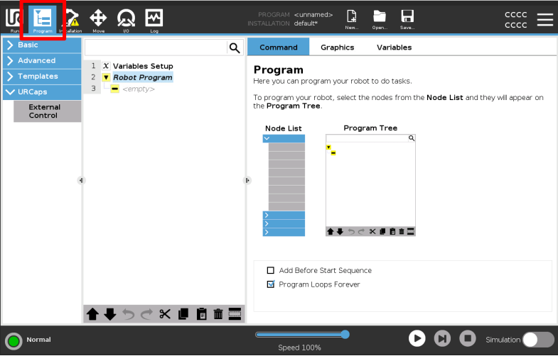

# Teach Pendant Features
The following document highlights step-by-step certain operational workflows using the UR Teach Pendant.

# Table of Contents  

## General Guide

### [Setting up the robot](#setting-up-the-robot-1) 

### [Teleoperating the robot](#teleoperating-the-robot-1)

### [Creating a program](#creating-a-program-1)  

### [Running a program](#running-a-program-1)  

## For running of real hardware:

### [Check/Edit Robot IP Address](#check-or-edit-robot-ip-address)

### [Check/Edit External Control IP Address](#check-or-edit-external-control-ip-address)

### [Check/Edit Computer IP Address](#check-or-edit-computer-ip-address-ubuntu)  

---

## Setting up the robot

 

 

 

Wait until all circles are green before exiting.

 

## Teleoperating the robot

 

 

## Creating a program

First ensure that you are in the “Program” Tab of the teach pendant

 

Browse through the various elements you can add to a program. In this example, lets make a program that allow us to control the robot externally. Click the External Control button. It will then be automatically added to the Robot Program tree.

 

### If you are using a real UR Robot, note that this IP address needs to be the IP address of your workstation when it is connected to the robot. Ignore if you are using URSim.

## Running a program

 

You can either run the program from a specific part of the sequence, or from the beginning

 

If the program runs, you should see the symbol below

 

## Check or edit Robot IP Address

 

 

 

 

 

**Note: You only need to change the IP Address of the robot when you are connecting with the Real Hardware. for URSim, the IP Address is already preset (`192.168.56.101`)**

## Check or edit External control IP Address

### Check External Control IP Address

To check the expected external control IP address to use, look at the external control component in the `Program` Tab.

 

### Edit External Control IP Address

In the `Installation` tab, under the `External Control` Sub-tab, you can change the IP address. Ensure that this is aligned to your [Computer's IP Address](#check-or-edit-computer-ip-address-ubuntu)

 

## Check or edit Computer IP Address (Ubuntu)

 

Select the settings for the specific ethernet connection

 

Ensure that the manual IP that is set corresponds to the External Control IP address.

 

