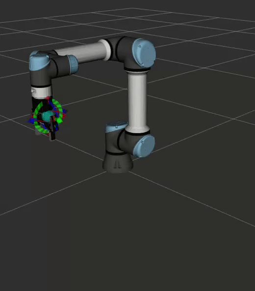

# Introduction to ROS2 Manipulation Exercise 3

## Exercise Objective

This exercise will require the learner to use moveit to develop a simple pick and place workflow as shown below.


<br>

Note that in this exercise, the gripper would not be able to move yet, we will be focusing on actuating the UR Robot instead.

## Technical requirements

In the `exercise_3` folder, we have created a ros2 package, `pick_and_place`. In this exercise you will need to fill up the `pick_and_place.cpp` file located in the `src` folder of the `pick_and_place` package. Find all the `TODO:` sections of the code to fill up its contents. 

For reference, you can make use of the [Moveit2 Basics Tutorial](https://moveit.picknik.ai/humble/doc/examples/move_group_interface/move_group_interface_tutorial.html) To find the correct Move Group APIs to use

## Test if it works!

There are 3 different methods to running this example

### For Mock Driver

First, ensure that inside the `pick_and_place/config/config.yaml` file, change the following parameters:

```yaml
use_fake_hardware: 'true'
```

Next, build and source your workspace, then run the Mock driver

In Terminal 1: 

```bash
cd <workspace>

colcon build

source install/setup.bash

ros2 launch pick_and_place ur_bringup.launch.py
```

In Terminal 2: 
```bash
cd <workspace>

source install/setup.bash

ros2 launch pick_and_place pick_and_place.launch.py
```
You should now be able to see the Pick and Place solution you have created executed in the RViz Simulation.

### For UR Sim Driver
If you want to run the UR Sim version of the driver, you will need to first run the URSim docker in a seperate terminal

In Terminal 1: 

```bash
cd <workspace>

source install/setup.bash

ros2 run ur_client_library start_ursim.sh -m ur5e
```
Ensure to go to the link and configure the polyscope to be ready for use with the driver.

Next, ensure that inside the `pick_and_place/config/config.yaml` file, change the following parameters:

```yaml
robot_ip: '192.168.56.101' # Address of the polyscope

use_fake_hardware: 'false'
```

Next, build and source your workspace, then run the UR driver

In Terminal 2: 

```bash
cd <workspace>

colcon build

source install/setup.bash

ros2 launch pick_and_place ur_bringup.launch.py
```

In Terminal 3: 
```bash
cd <workspace>

source install/setup.bash

ros2 launch pick_and_place pick_and_place.launch.py
```
You should now be able to see the Pick and Place solution you have created executed in the RViz Simulation.

### For Real UR Hardware Driver

** Warning, only do this if you have been trained to use the actual UR Manipulator Hardware**

Ensure to go to the link and configure the polyscope to be ready for use with the driver.

Next, ensure that inside the `pick_and_place/config/config.yaml` file, change the following parameters:

```yaml
robot_ip: <Check your polyscope for the IP address> # Address of the polyscope

use_fake_hardware: 'false'
```

Next, build and source your workspace, then run the UR driver

In Terminal 2: 

```bash
cd <workspace>

colcon build

source install/setup.bash

ros2 launch pick_and_place ur_bringup.launch.py
```

In Terminal 3: 
```bash
cd <workspace>

source install/setup.bash

ros2 launch pick_and_place pick_and_place.launch.py
```
You should now be able to see the Pick and Place solution you have created executed in the RViz Simulation.

