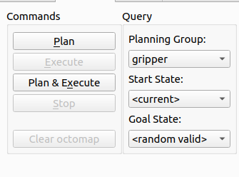
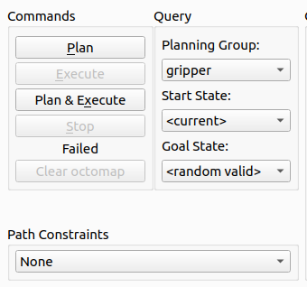

# Introduction to ROS2 Manipulation Exercise 4

## Exercise Objective

This exercise allows learners to explore how to add a new controller to an existing ROS2 Control interface. While there is no activity that needs to be done, Learners should spend some time understanding how to load a new controller to an existing ROS2 Control instance that is already running a controller manager

## 1. Lets try to move the gripper.
First, ensure that inside the `pick_and_place/config/config.yaml` file, change the following parameters:

```yaml
use_fake_hardware: 'true'
```


In a terminal, launch the same launch file that launches a move group rviz instance of a UR Robot with a Gripper attached to it: 
```bash
cd <workspace>

colcon build

source install/setup.bash

ros2 launch pick_and_place ur_bringup.launch.py
```

Next, while the `gripper` planning group is selected on the GUI, try to set its `Goal State` to `<random valid>` and try to `Plan and Execute`.


<br>


You will see that the execution fails in Rviz. On the terminal, you should see this error: 


<br>

```bash
[move_group-1] [ERROR] [1700442795.910210546] [moveit.simple_controller_manager.follow_joint_trajectory_controller_handle]: Action client not connected to action server: gripper_controller/follow_joint_trajectory
[move_group-1] [ERROR] [1700442795.910487657] [moveit_ros.trajectory_execution_manager]: Failed to send trajectory part 1 of 1 to controller gripper_controller
[move_group-1] [INFO] [1700442795.910749098] [moveit_ros.trajectory_execution_manager]: Completed trajectory execution with status ABORTED ...
[move_group-1] [INFO] [1700442795.919108226] [moveit_move_group_default_capabilities.move_action_capability]: Solution found but controller failed during execution
[rviz2-2] [INFO] [1700442795.920197151] [move_group_interface]: Plan and Execute request aborted
[rviz2-2] [ERROR] [1700442795.920708899] [move_group_interface]: MoveGroupInterface::move() failed or timeout reached
```

This shows that there is an issue with the controller!. To check, let us open a new terminal to see what controllers are available.

In a new terminal: 
```bash
cd <workspace>

source install/setup.bash

ros2 control list_controllers

```

You should now see a list of ROS2 Control controllers as seen below
```bash
joint_state_broadcaster[joint_state_broadcaster/JointStateBroadcaster] active    
speed_scaling_state_broadcaster[ur_controllers/SpeedScalingStateBroadcaster] active    
joint_trajectory_controller[joint_trajectory_controller/JointTrajectoryController] active    
force_torque_sensor_broadcaster[force_torque_sensor_broadcaster/ForceTorqueSensorBroadcaster] active    
forward_position_controller[position_controllers/JointGroupPositionController] inactive  
```

Next, take a look at the Moveit2 Controllers we spawned by looking at the available actions.

```bash
ros2 action list
```
You should see the following action interfaces available.
```bash
/execute_trajectory
/gripper_controller/follow_joint_trajectory
/joint_trajectory_controller/follow_joint_trajectory
/move_action

```

Moveit2 Controllers spawned are the `joint_trajectory_controller` and `gripper_controller`. This can also be seen in the `ur_gripper_moveit_config/config/moveit_controllers.yaml` file :

```yaml

# MoveIt uses this configuration for controller management

moveit_controller_manager: moveit_simple_controller_manager/MoveItSimpleControllerManager

moveit_simple_controller_manager:
  controller_names:
    - joint_trajectory_controller
    - gripper_controller
```

The Moveit2 Controllers available are **joint_trajectory_controller** and **gripper_controller**, but ROS2 Control only has **joint_trajectory_controller**!

This means that we are missing the **gripper_controller** ROS2 Control Controller! Now let us try to load this controller via a launch file.

## 2. Loading the gripper ros2 control controller.

In a new terminal, execute the following:

```bash
cd <workspace>

source install/setup.bash

ros2 launch gripper_driver_interface gripper_bringup.launch.py

```

You should see the following confirmation that your ROS2 Control Controller has been loaded
```bash
[spawner-1] [INFO] [1700444393.883952689] [spawner_gripper_controller]: Loaded gripper_controller
[spawner-1] [INFO] [1700444395.071321359] [spawner_gripper_controller]: Loaded /home/rosi/workspaces/training_ws/install/gripper_driver_interface/share/gripper_driver_interface/config/controllers.yaml into gripper_controller
[spawner-1] [INFO] [1700444395.086038002] [spawner_gripper_controller]: Configured and activated gripper_controller
[INFO] [spawner-1]: process has finished cleanly [pid 48508]

```

Now let us check again, which ROS2 Controllers are loaded on the control manager. In the same terminal, run the following.
```bash
ros2 control list_controllers
```

You should see the following Controllers:

```bash
joint_state_broadcaster[joint_state_broadcaster/JointStateBroadcaster] active    
speed_scaling_state_broadcaster[ur_controllers/SpeedScalingStateBroadcaster] active    
joint_trajectory_controller[joint_trajectory_controller/JointTrajectoryController] active    
force_torque_sensor_broadcaster[force_torque_sensor_broadcaster/ForceTorqueSensorBroadcaster] active    
forward_position_controller[position_controllers/JointGroupPositionController] inactive  
gripper_controller[joint_trajectory_controller/JointTrajectoryController] active    
```
As seen in the last line, `gripper_controller` controller is now loaded and active. Now, let us try (1) again. Ensure the `planning_group` is set to `gripper`, and set the `Goal State` to `<random_valid>` and select `Plan and Execute`. The gripper should now move. 