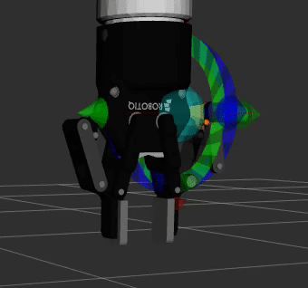

# Introduction to ROS2 Manipulation Exercise 5

## Exercise Objective

This exercise allows learners to explore how to write a Gripper Service Client to interact with a service server advertised by a robotiq gripper driver.

In the `exercise_5` folder, inside the `supplementary_packages` folder, you will see two different folders.

`robotiq_driver` provides the real driver for interacting with the physical Robotiq-2f 85 gripper
`robotiq_ros_service` is a ros2 package that updates the numerical values of the joints of the robotiq gripper, and publishes joint states based on the requested grasp instructions to moveit

In this exercise, we will be running the `robotiq_ros_service` and creating a client to trigger the robot to move in simulation. Your solution should show the following


<br>

## Technical requirements

In the `exercise_5` folder, you will also see a ros2 package `robotiq_client`. You will need to populate the `TODO:`s in the file `robotiq_client/src/trigger_gripper.cpp`. This simple ros2 node will consistently call the gripper to open and close in a loop.

For the service request, populate the request with the following values:
```bash
    configuration : 1
    robotiq2f_type : 85
    rpr : gripper_width
    rsp : 255
    rfr : 255
    rmod : 0
```
The main part of the code is to send the ROS2 Service Client request to the required server, `/gripper_service`. If you are unclear on the ROS2 Service Server-Client principle, you may refer to the [Service Server-Client Tutorial](https://docs.ros.org/en/foxy/Tutorials/Beginner-Client-Libraries/Writing-A-Simple-Cpp-Service-And-Client.html). Pay attention to the **Service Type** required.


## Test if your code works

To test this exercise, you will need 4 terminals.

Terminal 1 (UR Bringup)
```bash

cd <workspace>

source install/setup.bash

ros2 launch pick_and_place ur_bringup.launch.py

```
Terminal 2 (Load Gripper ROS2 Control Controller)
```bash

cd <workspace>

source install/setup.bash

ros2 launch gripper_driver_interface gripper_bringup.launch.py

```
Terminal 3 (Run Gripper Driver (Fake Driver))
```bash

cd <workspace>

source install/setup.bash

ros2 launch robotiq_ros_service robotiq_ros_service.launch.py

```
Terminal 4 (Run Gripper Client)
```bash

cd <workspace>

source install/setup.bash

ros2 run robotiq_client trigger_gripper

```

You should now see your Gripper constantly open and close.